# Evaluación de medidas de inflación basadas en la exclusión de gastos básicos

En esta sección se documentan los resultados del proceso de evaluación de las medidas de inflación interanual basadas en la exclusión fija de algunos gástos básicos que componen el Índice de Precios al Consumidor. Además de esto, se expone un procedimiento por el cuál se optimiza la exclusión de gastos básicos, a través de la aplicación de la HEMI y diferentes criterios de descarte de los mismos.

Las medidas evaluadas en en la presente sección son las siguientes:

1. Medida de inflación subyacente de exclusión fija de alimentos y energéticos, la cual forma parte del conjunto de medidas de inflación subyacente que integran la medida de inflación subyacente oficial, actualmente vigente en el Banco de Guatemala.

2.	Medida de inflación subyacente de exclusión fija de energéticos, la cual forma parte del conjunto de medidas de inflación subyacente que integran la medida de inflación subyacente oficial, actualmente vigente en el Banco de Guatemala.

3.	Medida de inflación subyacente de exclusión fija de alimentos y energéticos, en la cual queden excluidos todos los alimentos y todos los productos energéticos que forman parte del IPC de Guatemala.

4. Medida de exclusión óptima, la cual es seleccionada a través del proceso de optimización del MSE promedio, al aplicar la HEMI con criterios básicos sobre una lista de medidas de exclusión formada utilizando un criterio de ordenamiento de gastos básicos para su exclusión. Esta medida es la que presenta menor MSE a través de los diferentes criterios de ordenamiento. Este proceso será detallado en secciones posteriores. 

Además, se añade un análisis de sensibilidad el cual se efectúa alterando algunos parámetros respecto a los supuestos básicos.

## Cómputo de la medida de exclusión óptima

La medida de exclusión óptima es una medida de inflación subyacente de exclusión fija, en donde los gastos básicos excluidos son seleccionados a través de la aplicación sucesiva de la HEMI, sobre un conjunto de posibles exclusiones, siendo seleccionada aquella que optimice el estadístico deseado. En este trabajo se ha optado por utilizar los criterios básicos de evaluación, en donde se busca minimizar el MSE promedio, resultado de la aplicación sucesiva antes mencionada. 

Para el cómputo de las medidas óptimas de exclusión fija, se utilizaron los siguientes criterios de ordenamiento:

* Desviación estándar de los gastos básicos, ordenado de forma descendente.
* Correlación de la variación interanual de los gastos básicos respecto a la inflación interanual calculada a través del percentil 72 equiponderado de los gastos básicos, ordenado de forma ascendente.
* MSE de la variación interanual de los gastos básicos respecto a la inflación interanual calculada a través del percentil 72 equiponderado de los gastos básicos, ordenado de forma descendente.

Cada uno de los diferentes criterios fue aplicado tanto en la base 2000 como en la base 2010. La primera aplicando la HEMI con periodo de evaluación que abarca únicamente la base 2000 y, la segunda, utilizando el periodo de evaluación completo. Dado que para evaluar la base 2010 se utiliza el periodo completo (que abarca ambas bases), se computa, en la porción correspondiente a la base 2000, la inflación de exclusión óptima calculada únicamente para esa base. 

### Procedimiento general de optimización

El procedimiento general de optimización consiste en los siguientes pasos: 

1. Se toma una de las base de datos del IPC (base 2000 o 2010), la cual posee el índice, la variación intermensual o interanual de cada uno de los gastos básico en dicha base en un periodo de de tiempo. 

2. Se computa un estadístico para cada gasto básico, utilizando toda la información disponible en la base antes seleccionada.

3. Se ordenan los gástos básicos por medio del estadístico computado, de forma ascendente o descendente, según sea el caso. Por ejemplo, si se computa la desviación estándar de las variaciones intermensuales de los gatos básicos, se ordenarán de forma descendente, dado que volatilidades muy altas tienden a introducir una proporción de ruido excesivo en las medidas de inflación.

4. Se procede a realizar un procedimiento iterativo exploratorio, en donde se procede a aplicar la HEMI con 10,000 simulaciones del modo siguiente:
   1. Se procede a realizar la evaluación $i = 1,2,...N$, siendo $N$ el número total de gastos básicos, en donde se excluyen todos los gastos básicos con índice (respecto al orden impuesto) menores a $i$. Es decir, en la iteración $i=5$, se excluyen los gastos básicos que estén en la posición $1,2,3,4$. El caso especial corresponde a un $i=1$, en donde no se excluirá ningún gasto básico. 

   2. Del proceso iterativo anterior, se busca la posición $i$ que tiene el menor MSE promedio. 

   3. A partir de la posición $i$, se selección un sub rango $[i-k, i+k]$ que posteriormente será utilizado para la evaluación definitiva.

5. Se procede a realizar un procedimiento iterativo de optimización definitivo, en donde se procede a aplicar la HEMI con 125,000 simulaciones (definido en los criterios básicos) del modo siguiente:

   1. Se procede a realizar la evaluación $i \in [i-k, i+k]$, siendo $N$ el número total de gastos básicos, en donde se excluyen todos los gastos básicos con índices de orden (respecto al orden impuesto) menores a $i$. Es decir, en la iteración $i=i-k$, se excluyen los gastos básicos que estén en la posición $1,2,...,i-k-1$.

   2. Del proceso iterativo anterior, se busca la posición $i$ que tiene el menor MSE promedio. 

6. Dada la posición $i$ obtenida en el paso anterior, se listan aquellos gastos básicos con posición menor a la misma. Estos gastos básicos son los que serán excluidos en la medida de inflación subyacente.

### Resultados de la optimización de la medida de exclusión fija

En esta sección, se documentan los resultados de la aplicación de la HEMI al utilizar diferentes criterios de ordenamiento de gastos básicos para su exclusión. 

#### Criterio de desviación estándar

Utilizando este criterio, se presume que los gástos básicos con mayor volatilidad a lo largo de su historia introducen una componente de ruido tal que aleja la medida total de inflación de la verdadera inflación.

A continuación se presenta los resultados correspondientes sobre la base 2000. 

**Figura.** *Optimización exploratoria para la base 2000, utilizando el criterio de exclusión de desviación estándar. Todos los gastos básicos y extracto de los primeros 25.*

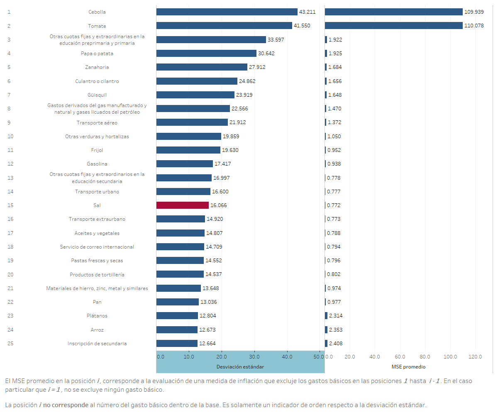

En la figura del lado izquierdo, se puede observar que la exclusión de los dos primeros gastos básicos (respecto al orden impuesto) generan la mayor ganancia en términos de disminución del MSE promedio en la evaluación.

La figura derecha es una vista rotada de la exposición con todos los gastos básicos, seleccionando los primero 25 gastos básicos ordenados según el criterio de desviación estándar. En dicha gráfica se observa una caída abrupta del MSE promedio en la posición 3, siendo la medida que excluye a la cebolla y el tomate, los cuales tienen la mayor volatilidad en toda la base 2000. También se observa que se alcanza el mínimo MSE promedio en la posición 15, la cual corresponde a la medida de inflación que excluye las primeros 14 gastos básicos. 

**Figura.** *Optimización definitiva para la base 2000, utilizando el criterio de exclusión de desviación estándar. Gastos básicos de la posición 5 a 25 según criterio de desviación estándar.*
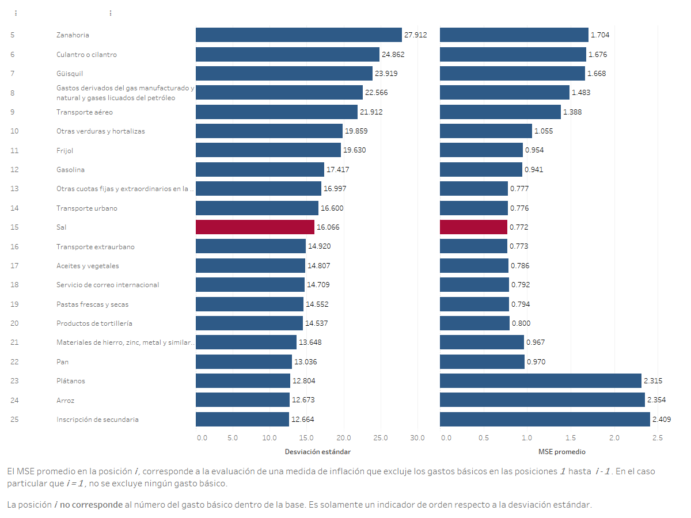

Tal como se expuso en los pasos para realizar la optimización, dado que la posición 15 en la optimización exploratoria tiene el menor MSE promedio, se selecciona las posiciones de la 5 a la 25 para ser evaluadas con 250,000 simulaciones, confirmando de este modo que las exclusión óptima se da en la posición 15. 

Por medio del mismo procedimiento, se procede a determinar la exclusión óptima en la base 2010. Se recuerda que dicha optimización se realiza aplicando la HEMI en un periodo de evaluación completo, pero, dado que entre la base 2000 y 2010 existen diferentes gastos básicos, se procede a aplicar la exclusión óptima calculada anteriormente (criterio de desviación estándar para la base 2010) en la porción de la evaluación donde se computa la inflación con la base 2000.

**Figura.** *Optimización exploratoria para la base 2010, utilizando el criterio de exclusión de desviación estándar. Todos los gastos básicos y extracto de los primeros 28.*
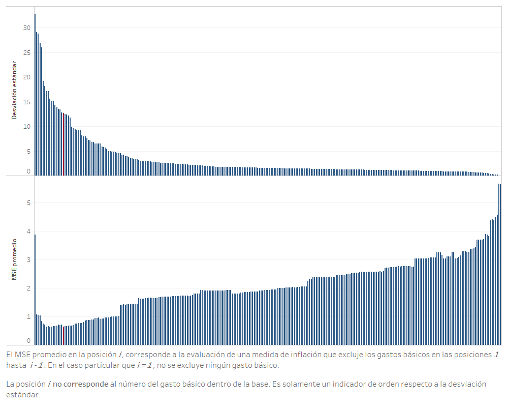
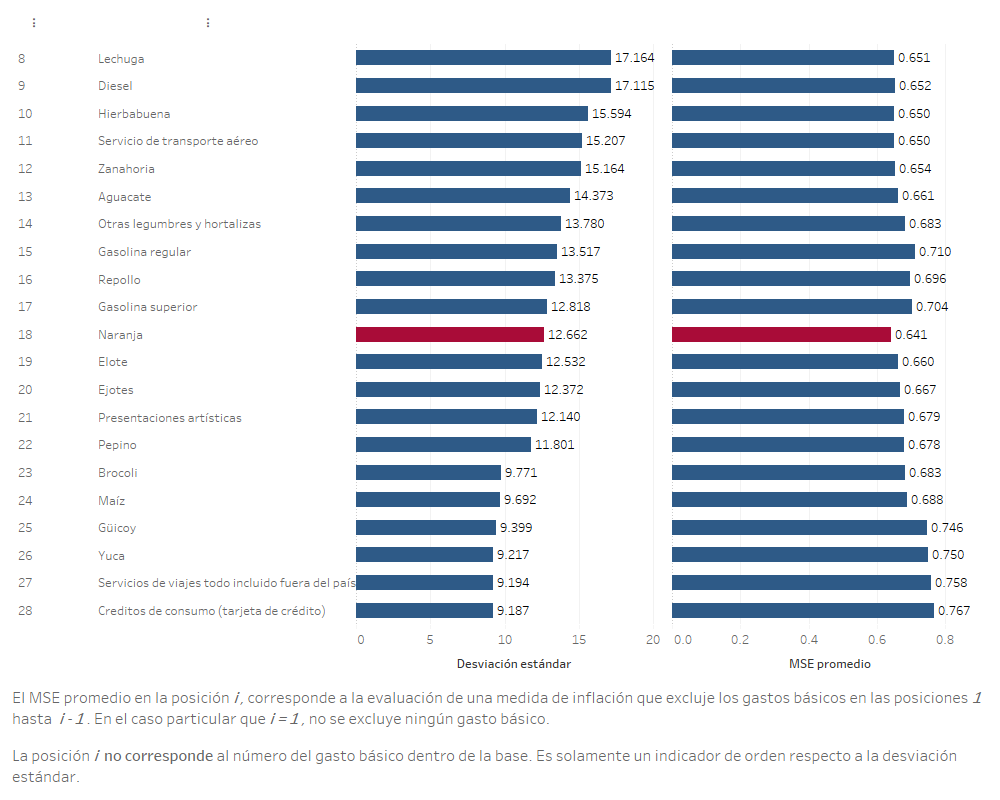

En el caso de la base 2010, se observa que la exclusión del gasto básico en la posición 1, correspondiente al tomate, provoca una caída abrupta en el MSE promedio respecto a la evaluación con la medida de inflación total. Además, se observa que los gástos básicos excluídos que dan origen a la medida óptima, pertenecen a los grupos de alimentos, combustibles y transporte.

**Figura.** *Optimización definitiva para la base 2010, utilizando el criterio de exclusión de desviación estándar. Gastos básicos de la posición 8 a 28 según criterio de desviación estándar.*

#### Criterio de correlación respecto a la inflación interanual percentil 72 equiponderado

El criterio de correlación respecto a la inflación interanual percentil 72 equiponderado se base en el supuesto que dicha inflación es la que mejor refleja la verdadera inflación macroeconómicamente relevante. Esto se fundamenta en el proceso de aplicación de la HEMI sobre dicha inflación, además de sus respectivos análisis de sensibilidad. En este caso, los gastos básicos son ordenados de forma ascendente, debido a que se considera que los gástos básicos con menor correlación son los que introducen ruido a la medida de inflación total.

**Figura.** *Optimización exploratoria para la base 2000, utilizando el criterio de correlación respecto percentil 72 equiponderado. Todos los gastos básicos.*

En la optimización exploratoria para la base 2000 se observa que la exclusión de los gástos básicos con correlación no disminuye el MSE promedio de la respectiva medida de exclusión. Se hace notar que la caía del MSE promedio se debe a la exclusión de la cebolla y el tomate. 

**Figura.** *Optimización definitiva para la base 2000, utilizando el criterio de correlación respecto percentil 72 equiponderado. Gastos básicos de la posición 65 a 85 según criterio de correlación respecto percentil 72 equiponderado.*
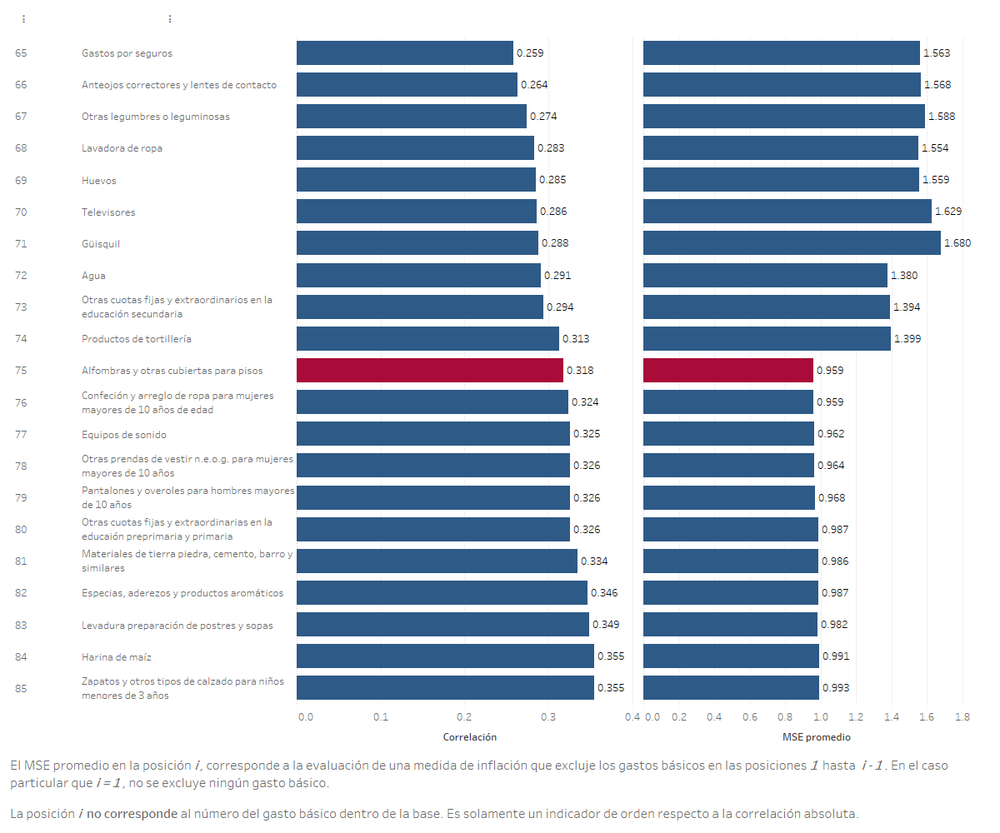

Se puede notar que la medida de exclusión óptima utilizando el criterio de correlación respecto percentil no excluye de forma eficiente los gástos básicos dentro de la base. Esto se hace notar debido a que la medida de exclusión con menor MSE promedio requiere la exclusión de 74 gastos básicos, además que esta medida tiene un MSE promedio mayor a la obtenida utilizando el criterio de desviación estándar sobre la misma base.

**Figura.** *Optimización exploratoria para la base 2010, utilizando el criterio de correlación respecto percentil 72 equiponderado. Todos los gastos básicos.*
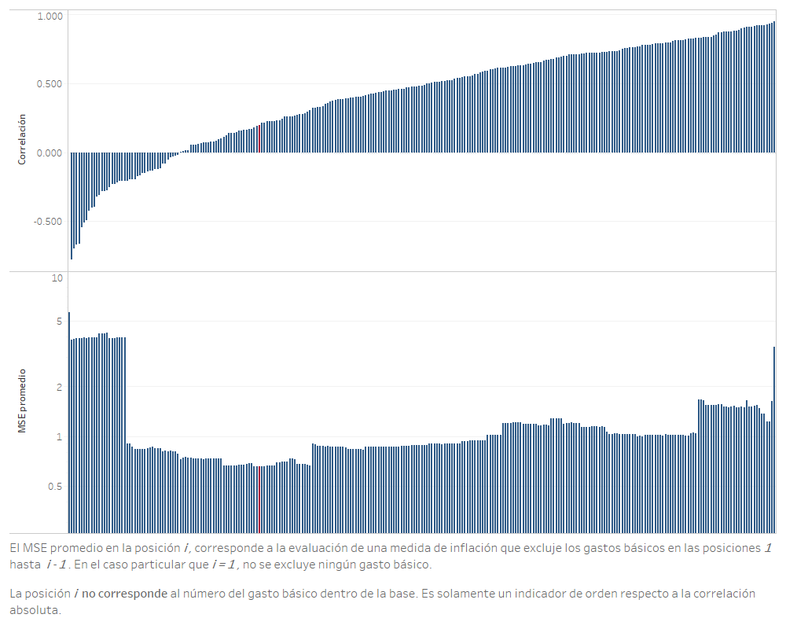

Del mismo modo que ocurre en la base 2000, el criterio de optimización en la base 2010 no es eficiente en la exclusión de gastos básicos, esto debido a que la correlación no permite descartar de forma temprana aquellos gastos básicos que introducen más ruido a la medida de exclusión.

**Figura.** *Optimización definitiva para la base 2010, utilizando el criterio de correlación respecto percentil 72 equiponderado. Gastos básicos de la posición 65 a 85 según criterio de correlación respecto percentil 72 equiponderado.*
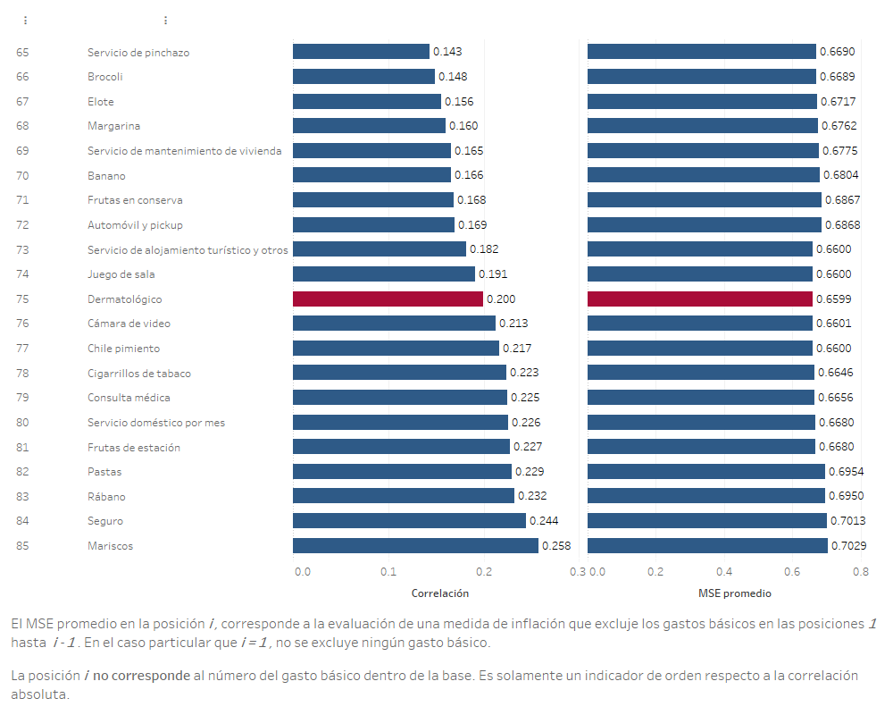

#### Criterio de MSE respecto a la inflación interanual percentil 72 equiponderado

El criterio de MSE respecto a la inflación interanual percentil 72 equiponderado se base en el supuesto que dicha inflación es la que mejor refleja la verdadera inflación macroeconómicamente relevante. Esto se fundamenta en el proceso de aplicación de la HEMI sobre dicha inflación, además de sus respectivos análisis de sensibilidad. En este caso, a diferencia del criterio de correlación, se desea que los gástos básicos seleccionados para ser excluidos sean aquellos que presentan una mayor separación respecto al percentil 72 equiponderado. Se ordenan los gastos básicos de forma descendente, dado que MSE mayores corresponden a gastos básicos que introducen ruido a la medida de inflación de exclusión.

**Figura.** *Optimización exploratoria para la base 2000, utilizando el criterio de MSE respecto a la inflación interanual percentil 72 equiponderado. Todos los gastos básicos.*

Del mismo modo que ocurre con el criterio de desviación estándar, el criterio de MSE respecto a la inflación interanual percentil 72 equiponderado es eficiente identificando aquellos gastos básico que introducen más ruido a la medida de inflación y, por lo tanto, implica una MSE promedio de evaluación más alto. 

**Figura.** *Optimización definitiva para la base 2000, utilizando el criterio de MSE respecto a la inflación interanual percentil 72 equiponderado. Gastos básicos de la posición 5 a 25 según criterio de MSE respecto a la inflación interanual percentil 72 equiponderado.*
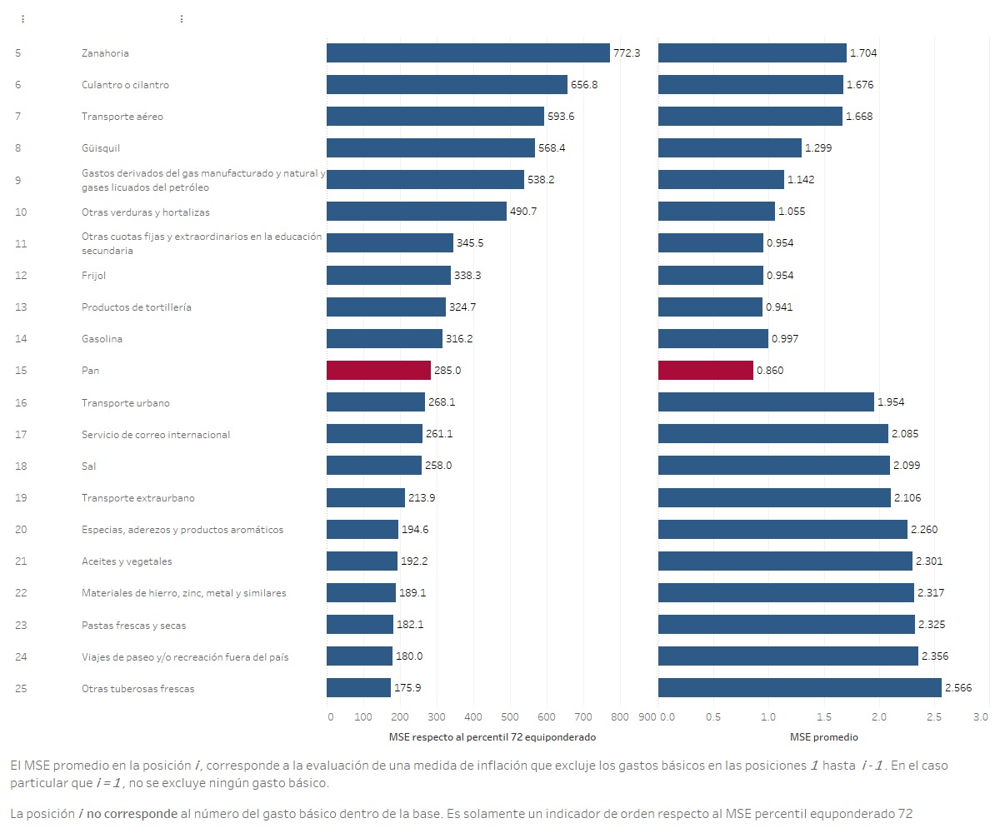

La observa que la medida óptima se encuentra en la posición 15, destacando el hecho que los gastos básicos descartados corresponden principalmente a los grupo de alimentos y combustibles.

**Figura.** *Optimización exploratoria para la base 2010, utilizando el criterio de MSE respecto a la inflación interanual percentil 72 equiponderado. Todos los gastos básicos.*

Tal y como se observa en el resultado exploratorio aplicado sobre la base 2000, la exclusión de los primeros gastos básicos (respecto a este ordenamiento) generan las mayores ganancias en cuanto a reducción del MSE. Estos gastos básicos corresponde a la cebolla y el tomate, tanto en la base 2000 como 2010. 

**Figura.** *Optimización definitiva para la base 2010, utilizando el criterio de MSE respecto a la inflación interanual percentil 72 equiponderado. Gastos básicos de la posición 5 a 25 según criterio de MSE respecto a la inflación interanual percentil 72 equiponderado.*
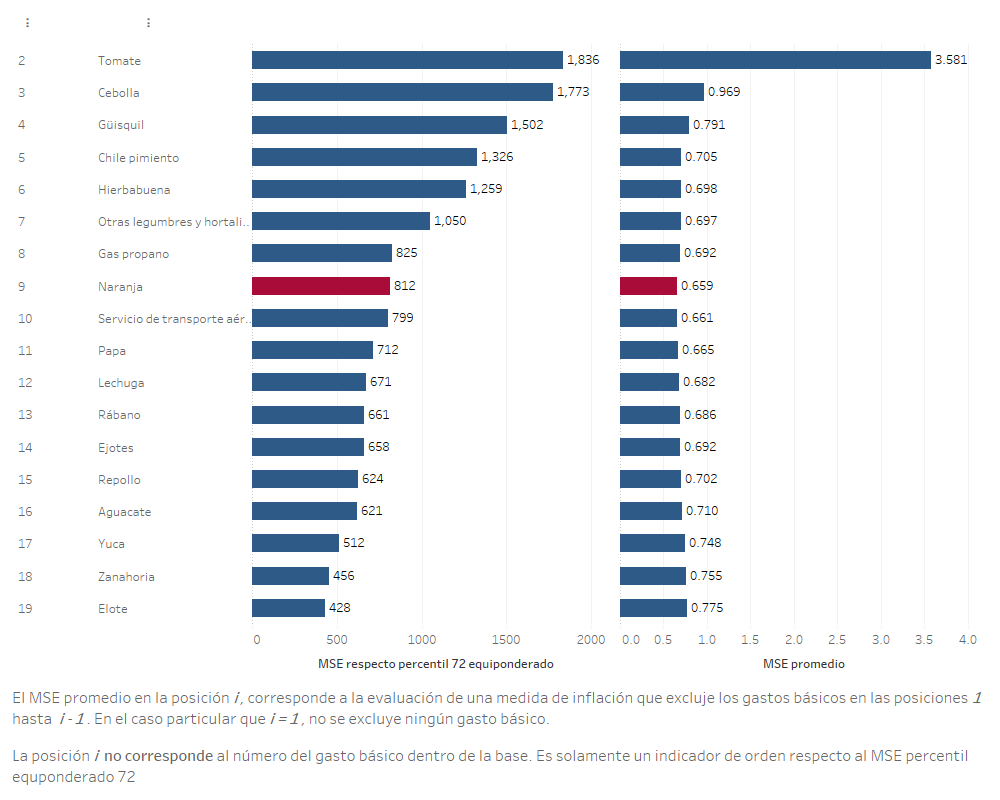

En el caso de la base 2010 y bajo este criterio de exclusión, solamente es necesaria la exclusión de 9 gastos básicos para obtener la medida con el MSE promedio de evaluación más bajo. 

#### Selección de criterio de exclusión para la aplicación en la evaluación de medidas

Dado que se poseen tres diferentes criterios de exclusión, es necesario elegir aquél que posea las características más deseables, siendo la principal característica la de obtener el menor valor de MSE promedio de evaluación usando los criterios básicos. A continuación se presenta una tabla resumen de los diferentes resultados de la evaluación según cada criterio

**Tabla.** *Resumen de resultados de la aplicación de los diferentes criterios de exclusión. MSE promedio en las diferentes bases.*

<table class="tg">
<thead>
  <tr>
    <th class="tg-ao2g">Medida de  exclusión</th>
    <th class="tg-ao2g">MSE promedio base 2000</th>
    <th class="tg-ao2g">MSE promedio base 2010 periodo completo de evaluación</th>
  </tr>
</thead>
<tbody>
  <tr>
    <td class="tg-ao2g">Desviación estándar</td>
    <td class="tg-ao2g">0.772</td>
    <td class="tg-ao2g">0.641</td>
  </tr>
  <tr>
    <td class="tg-ao2g">Correlación respecto a la inflación interanual percentil 72 equiponderado</td>
    <td class="tg-ao2g">0.959</td>
    <td class="tg-ao2g">0.660</td>
  </tr>
  <tr>
    <td class="tg-ao2g">MSE respecto a la inflación interanual percentil 72 equiponderado</td>
    <td class="tg-ao2g">0.860</td>
    <td class="tg-ao2g">0.659</td>
  </tr>
</tbody>
</table>

**Tabla.** *Resumen de resultados de la aplicación de los diferentes criterios de exclusión. Cantidad de gastos básicos excluidos en cada base.*

<table class="tg">
<thead>
  <tr>
    <th class="tg-ao2g">Medida de  exclusión</th>
    <th class="tg-ao2g">Cantidad de gastos básicos excluidos en la base 2000</th>
    <th class="tg-ao2g">Cantidad de gastos básicos excluidos en la base 2010</th>
    </tr>
</thead>
<tbody>
  <tr>
    <td class="tg-ao2g">Desviación estándar</td>
    <td class="tg-ao2g">14</td>
    <td class="tg-ao2g">17</td>
    </tr>
  <tr>
    <td class="tg-ao2g">Correlación respecto a la inflación interanual percentil 72 equiponderado</td>
    <td class="tg-ao2g">74</td>
    <td class="tg-ao2g">74</td>
    </tr>
  <tr>
    <td class="tg-ao2g">MSE respecto a la inflación interanual percentil 72 equiponderado</td>
    <td class="tg-ao2g">14</td>
    <td class="tg-ao2g">8</td>
    </tr>
</tbody>
</table>

Dada la información resumida en las tablas, el criterio de exclusión basado en al desviación estándar es el que produce la medida óptima de exclusión con menos MSE promedio respecto a todos los criterios propuestos. Esta medida excluye los siguientes gastos básicos:

* En la base 2000 del IPC se excluyen: 
   1. Cebolla
   2. Tomate
   3. Otras cuotas fijas y extraordinarias en la educaión preprimaria y primaria
   4. Papa o patata
   5. Zanahoria
   6. Culantro o cilantro
   7. Güisquil
   8. Gastos derivados del gas manufacturado y natural y gases licuados del petróleo
   9. Transporte aéreo
   10. Otras verduras y hortalizas
   11. Frijol
   12. Gasolina
   13. Otras cuotas fijas y extraordinarios en la educación secundaria
   14. Transporte urbano

* En la base 2010 del IPC se excluyen:
   1. Tomate
   2. Chile pimiento
   3. Gas propano
   4. Cebolla
   5. Culantro
   6. Papa
   7. Güisquil
   8. Lechuga
   9. Diesel
   10. Hierbabuena
   11. Servicio de transporte aéreo
   12. Zanahoria
   13. Aguacate
   14. Otras legumbres y hortalizas
   15. Gasolina regular
   16. Repollo
   17. Gasolina superior

El orden de los gastos básicos corresponde, de forma descendente, a la desviación estándar que estos presentan a lo largo de su historia en las respectivas bases. 

## Resultados de la evaluación de diferentes medidas de inflación

Dicha evaluación se llevó a cabo utilizando los criterios básicos, aplicados sobre las 4 diferentes medidas propuestas al inicio de la sección.

**Figura.** *Resultado de la evaluación con criterios básicos*

Se puede observar que, en primer lugar, la medida de exclusión fija que únicamente descarta los gastos básico del grupo de combustibles, presenta el mayor error estándar. Esto se debe a que los gástos básico con mayor volatilidad se encuentran dentro del grupo de los alimentos. En segundo lugar, se destaca que la medida de inflación que descarta todos los alimentos y energéticos posee un MSE promedio mayor a la medida que descarta algunos alimentos y energético y a la medida de exclusión óptima. Esto quiere decir algunos gastos básicos y energéticos aportan información de tal modo que la medida de exclusión se acerca más a la inflación paramétrica.En tercer lugar y, aunque descartar algunos gastos básicos de los grupo de alimentos y energéticos producen una medida mejor evaluada, el procedimiento de optimización junto a un criterio adecuado puede derivar en una medida mejor evaluada, tal es el caso de la medida de exclusión óptima en contra de la medida que excluye alimentos y energéticos seleccionados.

**Figura.** *Resultado de la evaluación con criterios básicos. Descomposición del MSE*
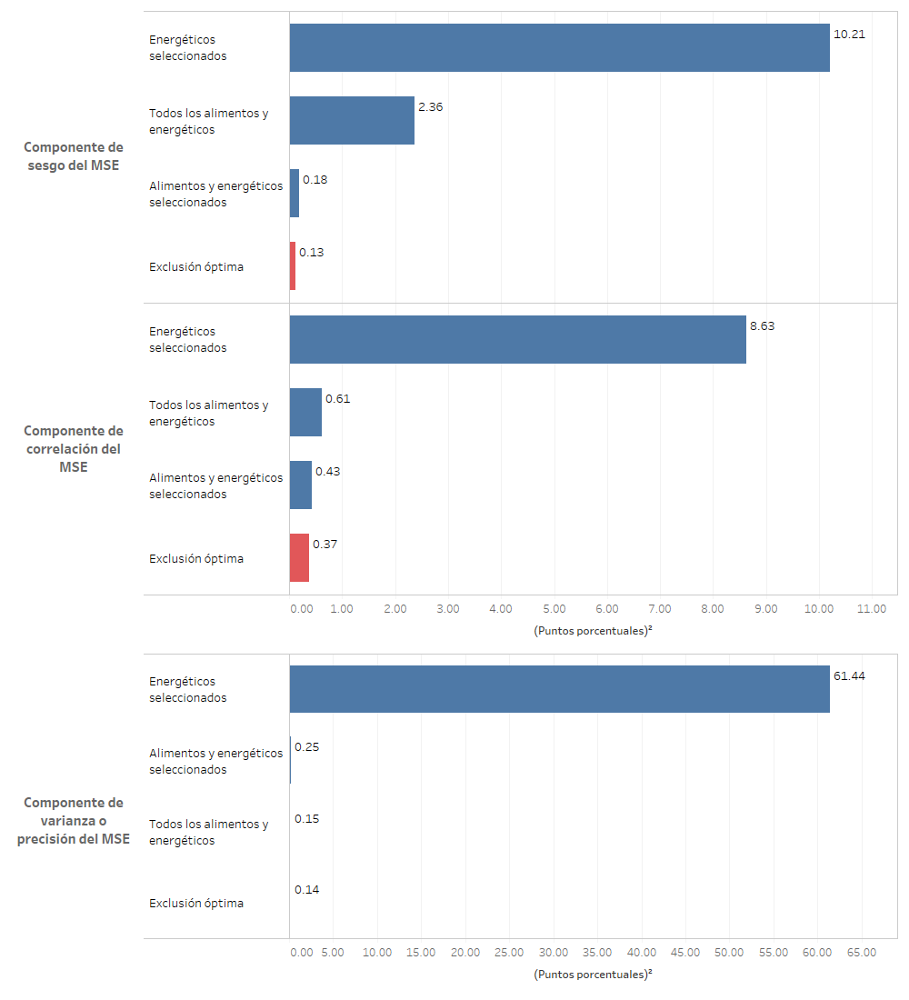

La gráfica anterior muestra la descomposición aditiva del error cuadrático medio en sus componentes de sesgo, varianza o precisión y correlación, con respecto a la trayectoria de inflación paramétrica, al utilizar los criterios básicos de evaluación. Se puede observar que la inflación que excluye únicamente los gástos básicos del grupo de combustibles es la que presenta los mayores componentes, destacando el componente de varianza, esto debido a que dentro del grupo de alimentos se encuentran los gastos básicos con mayor volatilidad. Se observa que en términos de componentes, la medida que excluye algunos alimento y energéticos y la medida de exclusión óptima presentan similares componentes de sesgo y varianza, siendo en el componente de correlación en el que se observa la diferencia más sustancial. 

## Análisis de sensibilidad

En esta sección se presentan los análisis de sensbilidad obtenidos en el ejercicio de evaluación de las medidas de inflación basadas en métodos de exclusión fija. 

### Análisis de sensibilidad ante cambios en el período final de evaluación

Debido a que se considera el período completo de evaluación hasta diciembre de 2019, se realiza un análisis de sensibilidad que considera los resultados ante un cambio en el período final de evaluación. Se consideran los siguientes períodos finales de evaluación:

* Diciembre de 2018
* Junio de 2019
* Diciembre 2019

**Figura.** *Análisis de sensibilidad respecto del período final considerado en la evaluación.*
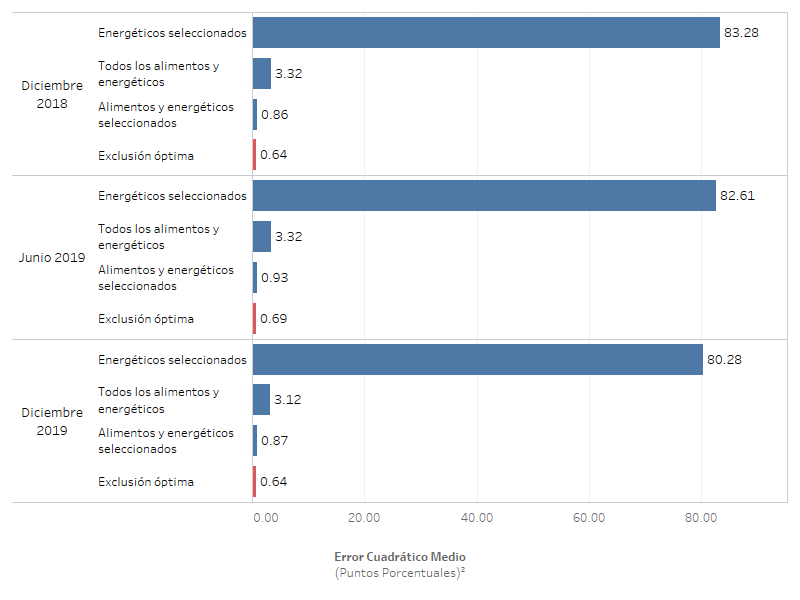

Como se puede observar, en todos los períodos finales considerados,la medida de exclusión óptima resulta invariantemente óptima en términos del MSE de evaluación. Estos resultados muestran que dicha medida óptima no es sensible a cambios en los períodos finales de evaluación que están separados entre 6 meses y un año.

### Análisis de sensibilidad ante cambio en la medida de evaluación

Considerando los estadísticos de evaluación alternativos, se construye una gráfica que ilustra el desempeño de las medidas consideradas, utilizando diferentes medidas de evaluación. Dicha gráfica se muestra a continuación.

**Figura.** *Análisis de sensibilidad respecto al cambio en la medida de evaluación.*

Se puede observar que la medida de exclusión óptima es la que obtiene las mejores evaluaciones, sin importar el estadístico utilizado. Cabe destacar que la medida de exclusión de alimentos y energéticos seleccionados se encuentra cercana a los resultados obtenidos a la medida de exclusión óptima. 

### Análisis de sensibilidad ante cambios en el subperíodo de evaluación

A continuación, se presenta un análisis de sensibilidad de la evaluación al considerar un cambio en el período de evaluación. La siguiente gráfica ilustra la evaluación de las diferentes medidas exclusión en los diferentes períodos de evaluación, mientras que el escenario base se observa en la última fila, correspondiente al período completo.

**Figura.** *Análisis de sensibilidad ante cambios en el subperíodo de evaluación.*

Se puede observar que la medida de exclusión óptima es la que obtiene las mejores evaluaciones, sin importar el periodo de evaluación utilizado. Se destaca que en el periodo de transición *2000-2010* se encuentran los mayores MSE promedio, derivado de la alta volatilidad en este periodo. Además, se observa que descarta únicamente algunos energéticos seleccionado posee los mayores MSE promedio.

### Análisis de sensibilidad ante cambios en la componente de tendencia

A continuación, se presenta un análisis de sensibilidad de la evaluación al considerar un cambio en la componente multiplicativa de tendencia en el procedimiento de evaluación. La siguiente gráfica ilustra la evaluación de las medidas de exclusión fija en tres escenarios de tendencia, siendo el escenario con criterios básicos el que se observa en la primera fila, correspondiente a la componente de tendencia de caminata aleatoria.

**Figura.** *Análisis de sensibilidad ante cambios en la componente de tendencia.*

Se puede observar que la medida de exclusión óptima es la que obtiene las mejores evaluaciones, sin importar la tendencia aplicada. Se destaca que la aplicación de tendencia siempre deriva en una MSE promedio mayor en todas las medidas, y que la componente exponencial es la que introduce más volatilidad e induce mayores errores estándares.

### Análisis de sensibilidad ante cambios en la trayectoria de inflación paramétrica

Ahora se presenta un análisis de sensibilidad de la evaluación al considerar un cambio en la trayectoria de inflación paramétrica del procedimiento de evaluación. La siguiente gráfica ilustra la evaluación de las diferentes medidas de exclusión fija utilizando tres diferentes parámetros de inflación, siendo el escenario base el que se observa en la primera fila, correspondiente a la evaluación respecto al parámetro de variación interanual del IPC con cambios de base.

**Figura.** *Análisis de sensibilidad ante cambios en la trayectoria de inflación paramétrica.*

Se puede observar que la medida de exclusión óptima es la que obtiene las mejores evaluaciones, sin importar el parámetro contra quien se esté evaluando. 

### Análisis de sensibilidad ante cambios en el número de simulaciones

En este caso, se realiza una prueba de sensibilidad cambiando el número de simulaciones a 500,000 realizaciones de las trayectorias de inflación muestral.

Como se muestra en la gráfica siguiente, los resultados coinciden sin mayor variabilidad. Esto se debe a que el número inicial de simulaciones es, en realidad, más que suficiente para la distribución del MSE de los estimadores muestrales (en realidad, con alrededor de 10,000 simulaciones se tenía errores estándar de simulación muy pequeños).

**Figura.** *Análisis de sensibilidad ante cambios en el número de simulaciones.*

### Análisis de sensibilidad ante cambios en el muestreo

Se realiza una prueba de sensibilidad utilizando como técnica de remuestreo la variante de nonoverlapping block bootstrap con bloques de 12 meses. El muestreo se realiza de forma independiente para cada unos de los gastos básicos en cada una de las bases del IPC. A continuación, se muestran los resultados en la gráfica siguiente.

**Figura.** *Análisis de sensibilidad ante cambios en el muestreo.*

Se destaca la disminución en el MSE promedio de la medida de inflación que excluye algunos energéticos. Esta reducción se justifica en la estructura de años completo de los datos contra la estructura mensual, dado que en el muestreo por bloque es menos frecuente la selección de aquellas variaciones intermensuales atípicamente altas o bajas.

### Distribuciones de simulación del MSE en las medidas óptimas

A continuación, se presentan gráficas de las distribuciones de simulación del MSE en el escenario base. Esta gráfica permite observar el rango, o amplitud, de la distribución de simulación del estadístico de evaluación a través de la gráfica de la distribución acumulada.

**Figura.** *Distribuciones de simulación del MSE de las medidas de exclusión fija con criterio basicos*.
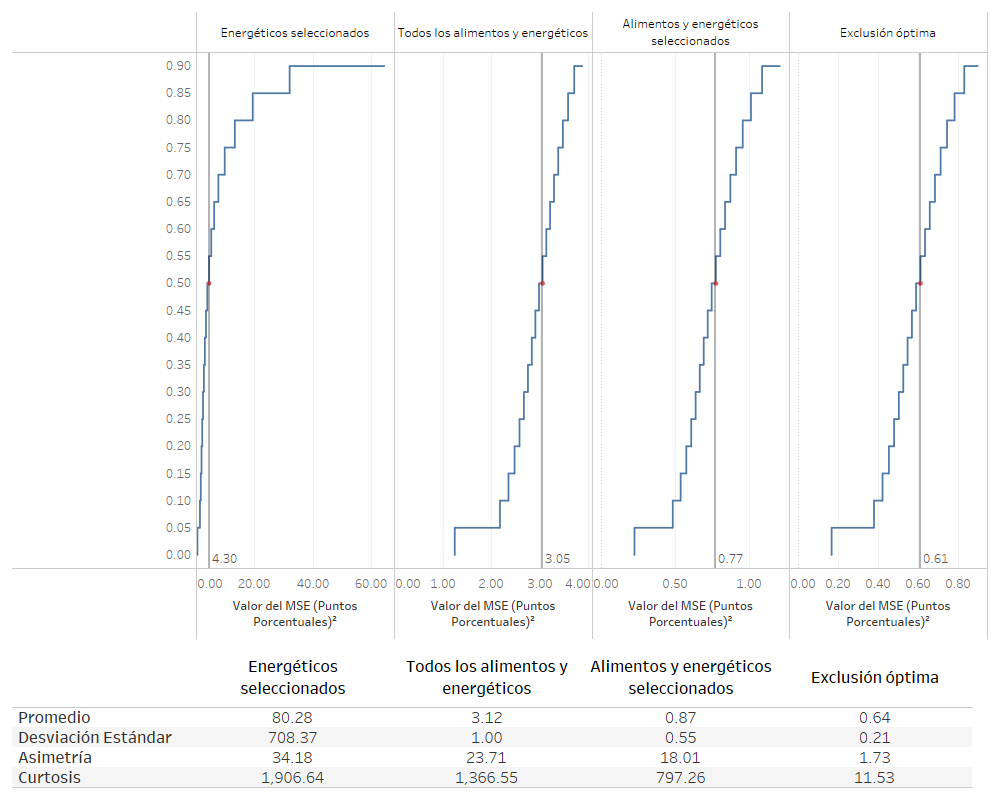

Se puede observar que la medida *Energéticos seleccionados* presenta la distribución de MSE promedio con mayor desviación estándar, asimetría y curtosis. Por el contrario, la medida denominada *Exclusión óptima* es la que presenta la menor curtosis y asimetría. 

A continuación, se muestra una gráfica similar, en la que se compara la amplitud de las distribuciones de simulación respecto al tipo de tendencia. Nuevamente, se observa que con cualquiera de los tres tipos de componentes de tendencia, se tienen distribuciones con mayor desviación estándar en la medida que solamente excluye alguno gastos básicos relacionado a energéticos.

**Figura.** *Distribuciones de simulación del MSE de las medidas de exclusión fija con criterio basicos, por tipo de tendencia aplicada en la evaluación*.

En la siguiente gráfica, se compara la amplitud de las distribuciones de simulación en los diferentes subperíodos de evaluación. En este caso, se observa que las distribuciones con mayor rango son las del período de transición, en cualquiera de los escenarios de tendencia. Además, se hace notar que al tendencia exponencial es la que produce una mayor amplitud en los rangos de MSE en todas las medidas de exclusión fija, así como cualquier periodo de evaluación. 

**Figura.** *Distribuciones de simulación del MSE de las medidas de exclusión fija con criterio basicos, por subperíodo de evaluación*.

## Análisis de trayectorias para los datos históricamente observados

A continuación, se presenta una gráfica del comportamiento históricamente observado de las diferentes medidas de exclusión evaluadas, comparándolas con la variación interanual del IPC, en el período de diciembre de 2001 a diciembre de 2019. Como se observa, en el período de la base 2000 del IPC, todas las medidas, excepto aquella que excluye todos los gastos básicos de los grupos de combustibles y alimentos, tienden a seguir el comportamiento de la inflación total con niveles cercanos y usualmente menores. Similarmente, se observa el mismo comportamiento en el periodo que comprende a la base 2010 del IPC. Se observa que la medida de inflación que excluye todos los alimentos y combustibles es la que mantiene el menor nivel en todos los periodos, así como una volatilidad reducida. 

**Figura.** *Trayectorias de inflación históricamente observadas de las medidas de exclusión fija evaluadas*.
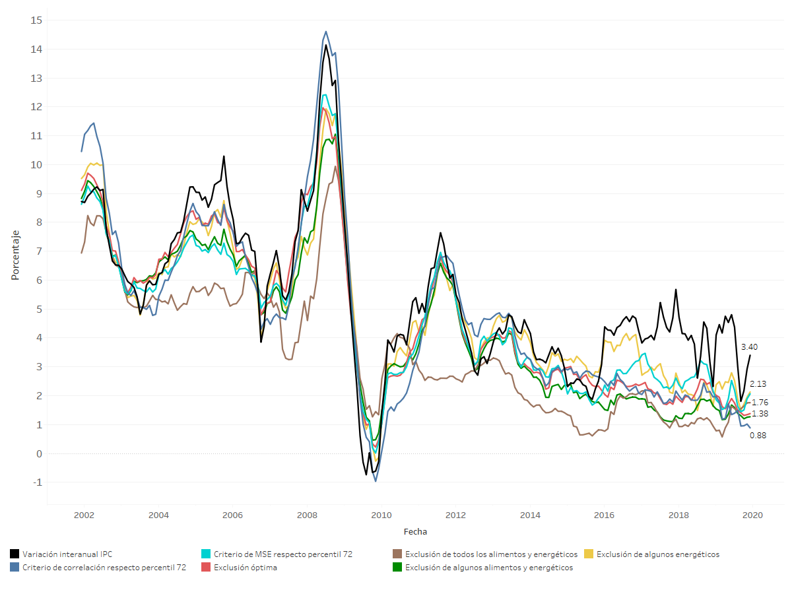